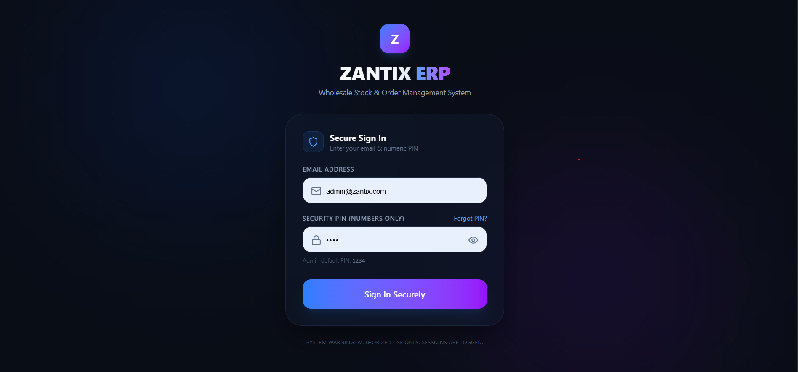
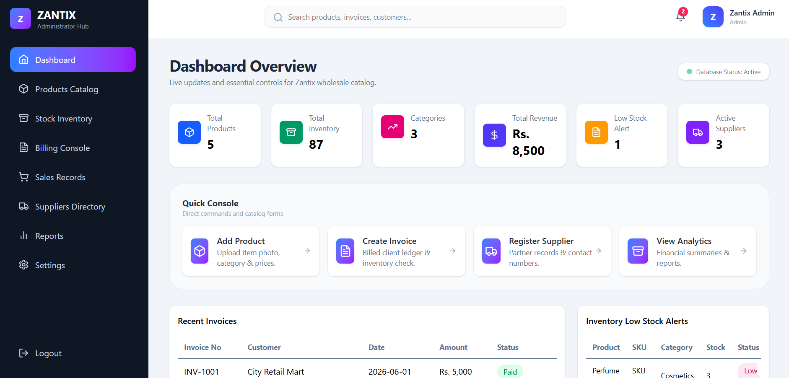
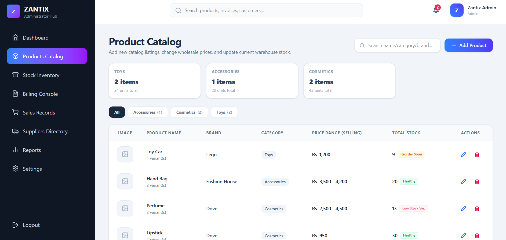
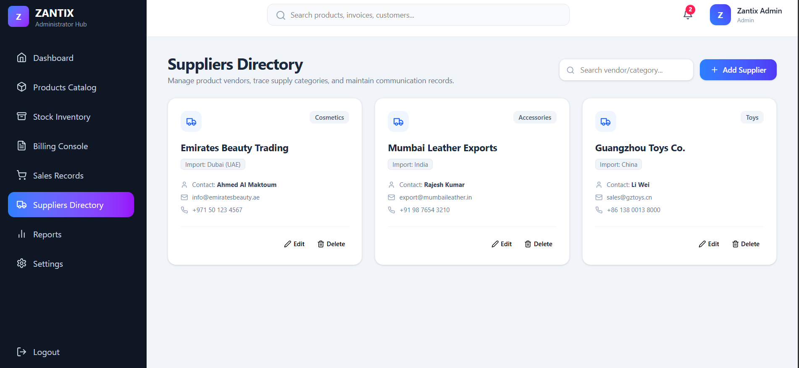
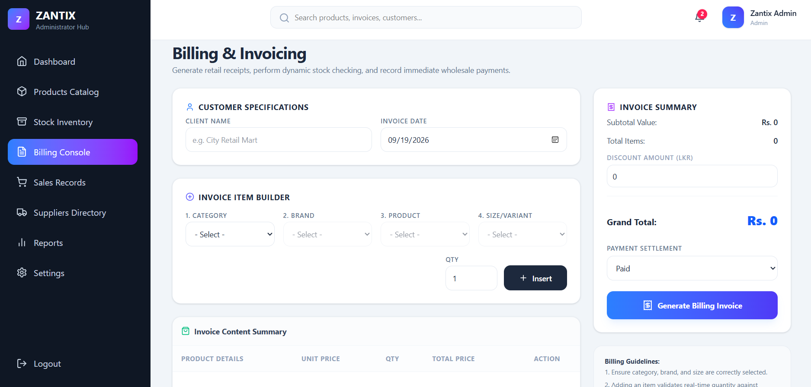

# ZANTIX-ERP

## About the Project
A web-based management system for a wholesale fancy shop.

## Features
- Product Management
- Supplier Management
- Inventory Management
- Invoice Management
- Customer Management
- Sales Reports

## Technologies Used
- React.js
- Node.js
- Express.js
- MongoDB

## Screenshots

### Login

### Dashboard

### Product Management

### Supplier Management

### Invoice Management

